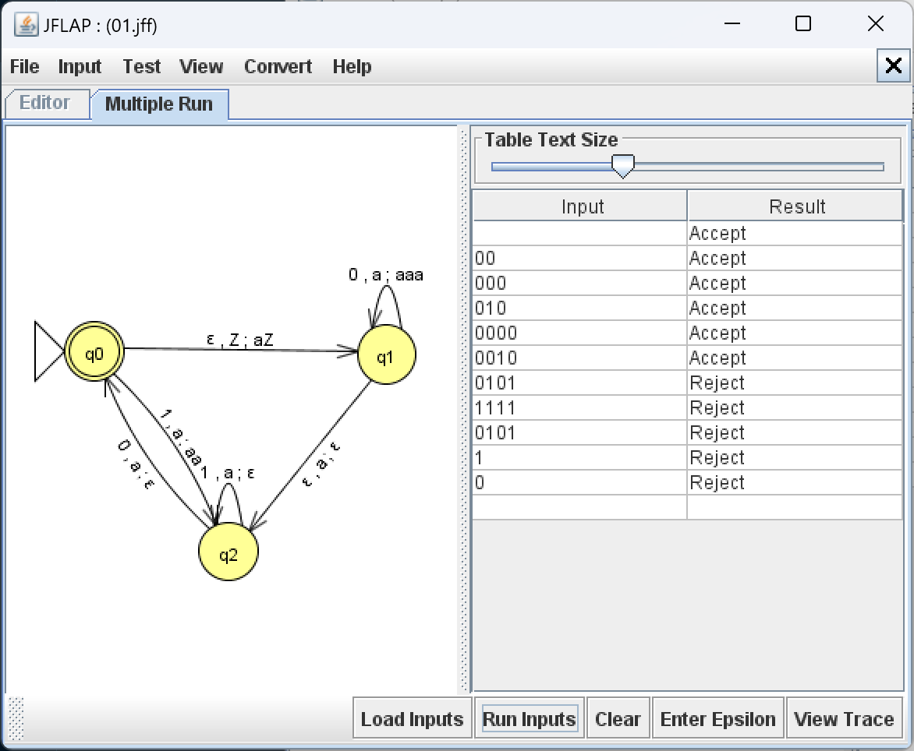
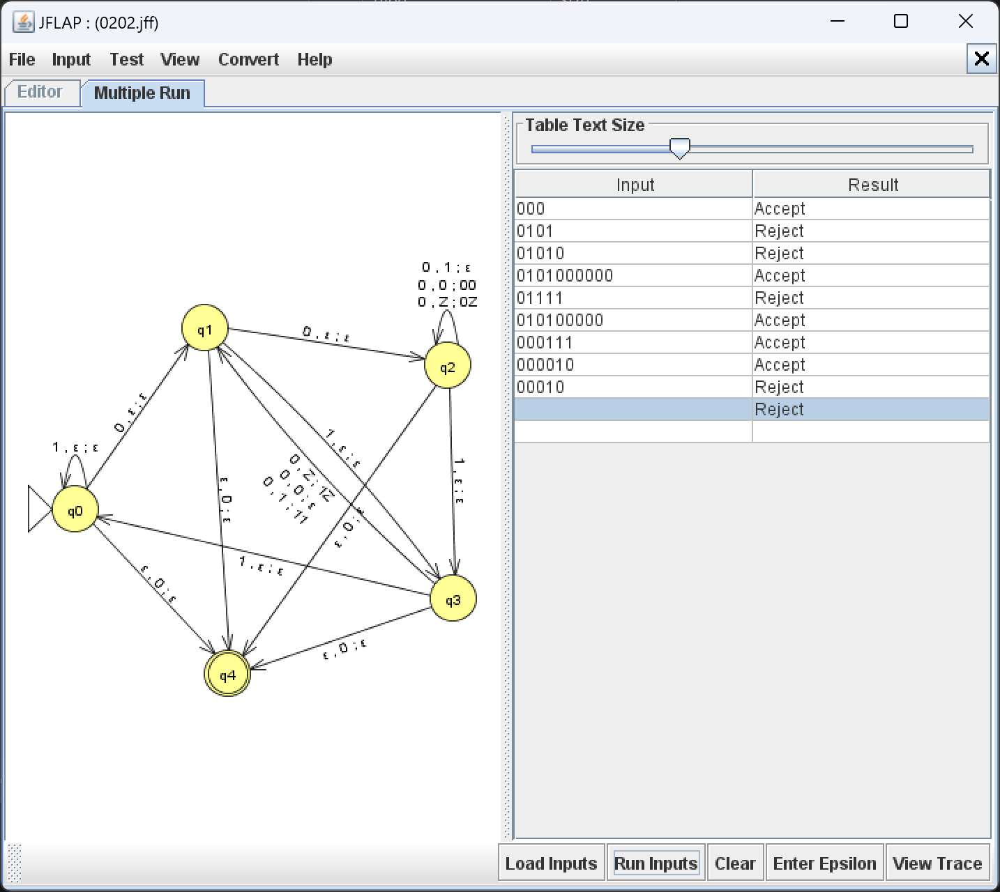

# 2. majas darbs

Gunārs Ābeltiņš

Šī ir papildus informacija anketas iesniegumam.

## 1. uzdevums



```py
I, J, K, M, = 2, 0, 0, 8

STATES = ["s_0", "s_1", "s_2"]
INPUT_ALPHABET = ["0", "1"]a
STACK_ALPHABET = ["z", "$"]
START_STATE = "s_0"
START_STACK_SYMBOL = "$"
ACCEPTING_STATES = ["s_0"]
TRANSITION_FUNCTION = {
    ("s_0", "", "$"): ("s_1", "z$"),
    ("s_1", "0", "z"): ("s_1", "zzz"),
    ("s_1", "", "z"): ("s_2", ""),
    ("s_2", "1", "z"): ("s_2", ""),
    ("s_2", "0", "z"): ("s_0", ""),
    ("s_" + str(K % 3), "1", "z"): ("s_" + str(M % 3), "zz"),
}
MAX_LENGTH = 4


def pushdown_automaton(str: str, curr_state: str, stack: str) -> bool:

    def accept(str: str, state: str, stack: str, symbol: str) -> bool:
        for i in range(1, len(stack) + 1):
            key = (state, symbol, stack[:i])
            if key in TRANSITION_FUNCTION:
                new_state, new_stack_insert = TRANSITION_FUNCTION[key]
                new_stack = new_stack_insert + stack[i:]
                if pushdown_automaton(str, new_state, new_stack):
                    return True
        return False

    if accept(str, curr_state, stack, ""):  # epsilon transition
        return True

    if str == "":  # end of input
        return curr_state in ACCEPTING_STATES

    return accept(str[1:], curr_state, stack, str[0])  # normal transition


if __name__ == "__main__":
    words = []
    for i in range(MAX_LENGTH + 1):
        for j in range(2**i, 2**(i+1)):
            word = bin(j)[3:]
            if pushdown_automaton(word, START_STATE, START_STACK_SYMBOL):
                words.append(word)

    print(f"Words accepted by the PDA ({len(words)}): ")
    for word in words:
        print(f"{word if word != "" else "ε"}, ", end="")

```

## 2. uzdevums



## 3. uzdevums

### Varbūtiskais automāts

```py
import numpy as np

I, J, K, M, = 2, 0, 0, 8

STATES = ["s_0", "s_1"]
INPUT_ALPHABET = ["a", "b"]
START_STATE = "s_" + str(J % 2)
ACCEPTING_STATES = ["s_" + str(K % 2)]
LAMBDA = 0.5
TRANSITION_MATRIX = {
    "a": np.array([
        [0, 1],
        [1, 0]
    ]),
    "b": np.array([
        [1/(M + 3), (M+2)/(M+3)],
        [1/(M + 3), (M+2)/(M+3)]
    ])
}
MAX_LENGTH = 4

def probabilistic_automaton(str: str) -> bool:
    state_probabilities = np.zeros(len(STATES))
    state_probabilities[STATES.index(START_STATE)] = 1

    for i in range(len(str)):
        state_probabilities = np.dot(
            state_probabilities, TRANSITION_MATRIX[str[i]])

    return state_probabilities[STATES.index(ACCEPTING_STATES[0])] >= LAMBDA


if __name__ == "__main__":
    words = []

    for i in range(MAX_LENGTH + 1):
        for j in range(2**i, 2**(i+1)):
            word = bin(j)[3:].replace("0", "a").replace("1", "b")
            if probabilistic_automaton(word):
                words.append(word)

    print(f"Words accepted by the probabilistic automaton ({len(words)}): ")
    for word in words:
        print(f"{word if word != "" else "ε"}, ", end="")

```

### Galīgs determinēts akceptors

```py
I, J, K, M, = 2, 0, 0, 8

STATES = ["s_0", "s_1"]
INPUT_ALPHABET = ["a", "b"]
START_STATE = "s_" + str(J % 2)
ACCEPTING_STATES = ["s_" + str(K % 2)]
TRANSITION_FUNCTION = {
    ("s_0", "a"): ("s_1"),
    ("s_0", "b"): ("s_1"),
    ("s_1", "a"): ("s_0"),
    ("s_1", "b"): ("s_1")
}
MAX_LENGTH = 4


def finite_state_machine(str: str) -> bool:
    current_state = START_STATE

    for i in range(len(str)):
        current_state = TRANSITION_FUNCTION[(current_state, str[i])]

    return current_state in ACCEPTING_STATES


if __name__ == "__main__":
    words = []

    for i in range(MAX_LENGTH + 1):
        for j in range(2**i, 2**(i+1)):
            word = bin(j)[3:].replace("0", "a").replace("1", "b")
            if finite_state_machine(word):
                words.append(word)

    print(f"Words accepted by the FSM ({len(words)}): ", words)

```

## 4. uzdevums

```py
import numpy as np

STATES = ["s_0", "s_1", "s_2", "s_3", "s_4", "s_5"]
INPUT_ALPHABET = ["a", "b"]
START_STATE = "s_0"
ACCEPTING_STATES = ["s_2", "s_4"]
LAMBDA = 0.0755 + 0.2482
A_FIRST, A_SECOND = 0.9, 0.5
B_FIRST, B_SECOND = 0.91, 0.95

TRANSITION_MATRIX = {
    "a": np.array([
        [0, 0.5 * A_FIRST, 0.5 * (1 - A_FIRST), 0.5, 0, 0],
        [0, A_FIRST, 1 - A_FIRST, 0, 0, 0],
        [0, 0, A_SECOND, 0, 0, 1 - A_SECOND],
        [0, 0, 0, 1, 0, 0],
        [0, 0, 0, 0, 1, 0],
        [0, 0, 0, 0, 0, 1]
    ]),
    "b": np.array([
        [0, 0.5, 0, 0.5 * B_FIRST, 0.5 * (1 - B_FIRST), 0],
        [0, 1, 0, 0, 0, 0],
        [0, 0, 1, 0, 0, 0],
        [0, 0, 0, B_FIRST, 1 - B_FIRST, 0],
        [0, 0, 0, 0, B_SECOND, 1 - B_SECOND],
        [0, 0, 0, 0, 0, 1]
    ])
}


def probabilistic_automaton(str: str) -> bool:
    """
    Accepts only string that contains 3 a's and 14 b's.

    Args:
        str (str): The input string to be checked.

    Returns:
        bool: True if the string is accepted, False otherwise.
    """
    state_probabilities = np.zeros(len(STATES))
    state_probabilities[STATES.index(START_STATE)] = 1

    for i in range(len(str)):
        state_probabilities = np.dot(
            state_probabilities, TRANSITION_MATRIX[str[i]])
        # for j in range(len(state_probabilities)):
        #     print(f"{state_probabilities[j]:.4f}", end=" ")
        # print()

    for j in range(len(state_probabilities)):
        print(f"{state_probabilities[j]:.4f}", end=" ")
    print()

    # return if sum of accepting states is greater than lambda

    return sum(state_probabilities[STATES.index(state)] for state in ACCEPTING_STATES) >= LAMBDA


if __name__ == "__main__":

    words = [
        ("b" * 14) + ("a" * 3),
        ("b" * 14) + ("a" * 4),
        ("b" * 15) + ("a" * 3),
        ("b" * 13) + ("a" * 3),
        ("a" * 3) + ("b" * 14),
        ("b" * 7) + ("a" * 2) + ("b" * 7),
        ("b" * 7) + ("a" * 3) + ("b" * 7)
    ]

    tests = {
        ("b" * 14) + ("a" * 3): True,
        ("b" * 14) + ("a" * 4): False,
        ("b" * 15) + ("a" * 3): False,
        ("b" * 13) + ("a" * 3): False,
        ("a" * 3) + ("b" * 14): True,
        ("b" * 7) + ("a" * 2) + ("b" * 7): False,
        ("b" * 7) + ("a" * 3) + ("b" * 7): True
    }

    for word in words:
        print(f"Word {word}: {probabilistic_automaton(word)}")

    for word, result in tests.items():
        assert probabilistic_automaton(word) == result

    print("All tests passed!")

    print(TRANSITION_MATRIX["a"])

    print(TRANSITION_MATRIX["b"])

```

